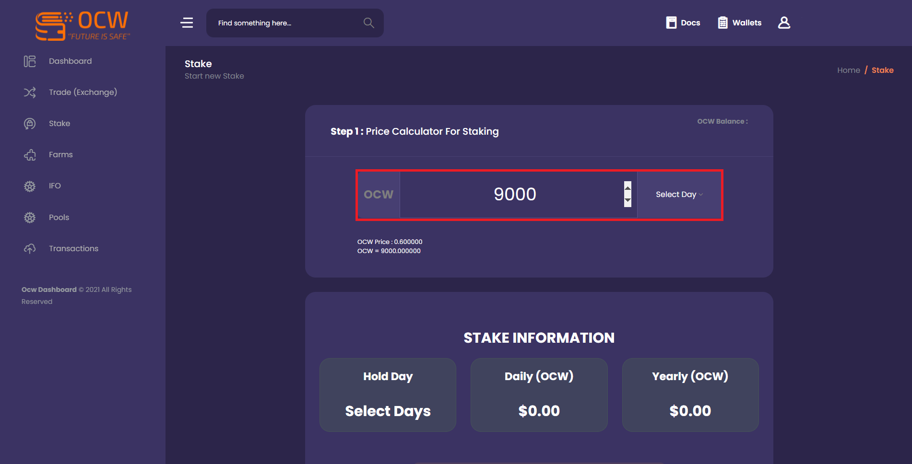
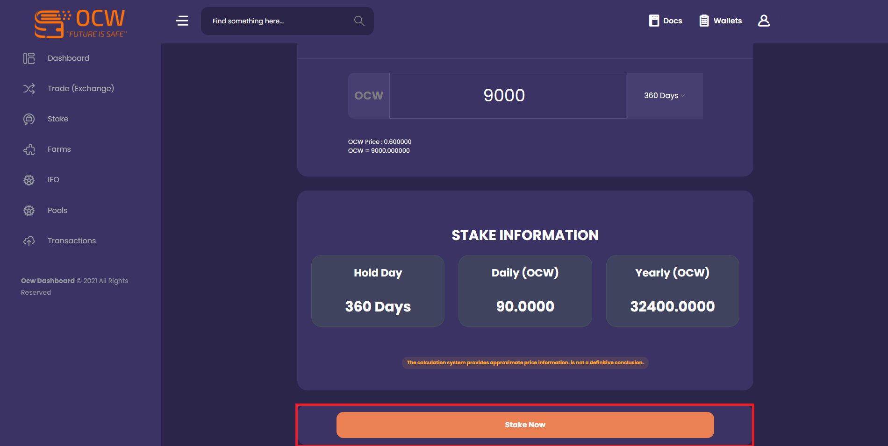

# Trade Earn Win

## You can follow the steps below to lock the OCW you have received through your registered account.

.png>)

Head to the stake page with the panel on the left of the screen, it should be noted that there are multiple packages offered to users.

Package 1: **OCW stake BUSD earn package**, day limit is **120** days. **120% APR **

Package 2: **OCW stake OCW boiler package**, day limit is **360** days. **360% APR**

After choosing between the packages, head to the **stake now button** on the right of the package and proceed.

Enter the amount you want to get a stake in the **total amount for stake** field on the screen that appears, with **numbers**, the **select day** button will not work and you will not be able to progress.

You can stake a minimum of **50 OC**W, there is **no maximum limit** requirement.

After entering the number you want to stake, select the day with the **select day** button and complete the process with the **stake now button** at the bottom of the page.

## About Other Benefits

For such advantages, you can choose from dozens of crypto assets on the STAKE page and earn daily, monthly and annual income.

 (1) (1).png>)

About early unlocking: Users can unlock and retrieve their tokens before expiration. In case of early exchange and redemption, the principal is returned to the spot account and the distributed yield is deducted from the refunded principal. It may take 48-72 hours for tokens to be credited to the account due to time zone differences.
