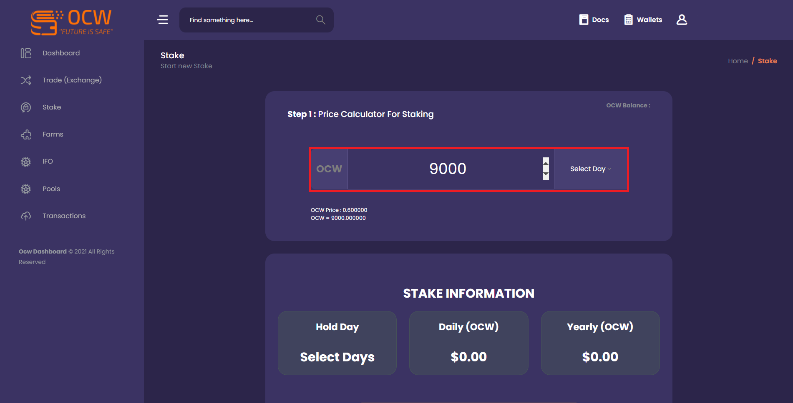

# Buy Coin

## Crypto Asset Sending

.png>)

After creating your user information, contact the wallet address created specifically for you from the Dashboard section. Send USDT with ERC20 network or BUSD or BNB with BSC20 network to the wallet address you have reached. Then go to the Trade tab.

## Exchange&#x20;

When you come to the From Option, enter the amount you want to purchase.

Example: 1000 USDT&#x20;

Then select the USDT asset from the Select Coin section.

Then select the Select Coin you want to buy for 1000 USDT and press the Swap button at the bottom of the page.
