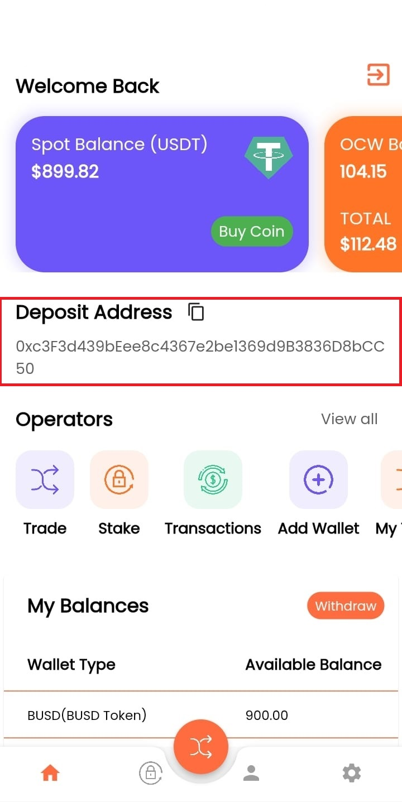

# Buy Coin

## Crypto Asset Sending

_After creating your user information, copy the wallet address created specifically for you from_ _the_ **Dashboard** _section. Send_ **USDT with ERC20** _network or_ **BUSD & BNB with BSC20** _network to the wallet address you have_ **reached**. _Then go to the_ **trade** _page._

## Exchange&#x20;

.jpg>)

_When you come to the first_ **Select A Token** _Option, enter the amount you want to purchase._

_Example: 1000 USDT_&#x20;

_Then select the_ **USDT - BNB - BUSD** _asset from the second_ **Select A Token** _section._
